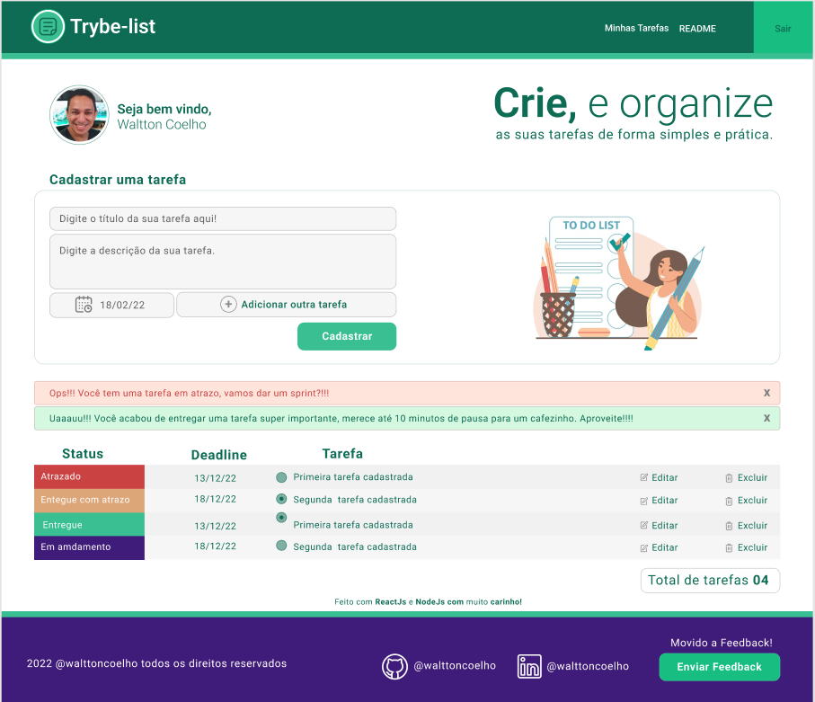

# todo-list-full
## Projeto para consolidação de conhecimento

## Começando com vite

Este projeto foi inicializado com $ npm create vite@latest my-vue-app -- --template react

## Scripts Disponíveis

# Pasta Back-end
- Esta é uma aplçicação de fornece uma API que possibilita ler, atualizar, gravar e deletar
- O Back-end é responsável por todas as operações de CRUD
##  Faça um clone do repositório aqui: 
~~~javascript
git clone git@github.com:walttoncoelho/back-end-todo-list.git
~~~
### Para esta aplicação foi utilizada o mongoose com node-restfull
Retorna um modelo Mongoose, para que se possa interagir de maneira mais simples e rápida.

## A API registra as seguintes rotas:
* GET /toddos
* GET /todos/:id
* POST /todos
* PUT /todos/:id
* DELETE /todos/:id

### 1- Instalando dependências.
*  Dentro da pasta do projeto exercute.
~~~javascript
npm i
~~~

### 2- Colocando em produção.
~~~javascript
npm run production
~~~

# Pasta Front-end

- Esta é uma aplicação que possibilita o usuário adicionar as suas tarefas, verificar o status, marcar como concluido e deletar as tarefas concluidas
>Para esta *aplicaçção*. resolvi passar os estados apenas com *props*.
>pois a ideia éra fazer uma aplicação bem simples e depois trabalhar em mais dois vercionamentos utilizando **ContextApi**, e uma última verssão aplicando **Redux**. Também dediquei um tempo no designer do projeto, acredito que assim fica mais fácil e claro ter uma visão MACRO do fluxo da aplicação. acesse o linque e dê uma conferida. **Figma** <https://www.figma.com/file/HkTxigUsDEU7jeL78WMbq7/Todo-List-Ebytr?node-id=0%3A1>.

##  Faça um clone do repositório aqui: 
~~~javascript
git clone git@github.com:walttoncoelho/front-end-list.git
~~~

### 1- Instalando dependências.
*  Dentro da pasta do projeto exercute.
~~~javascript
npm i
~~~

### 2- Para iniciar a aplicação use.
~~~javascript
npm run dev
~~~